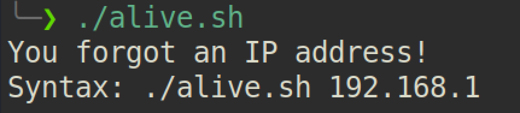

# Alive

> Find alive IP addresses in a network

## Screenshot 
 |


## Installation
#### Manually
1. Clone and make executable ```alive.sh``` by ```chmod +x alive.sh```.
2. Run ```./alive.sh 192.168.247```
3. Congratulations! 

## About Me

Aayush Pareek – [@MyTwitter](https://twitter.com/apareek99)
